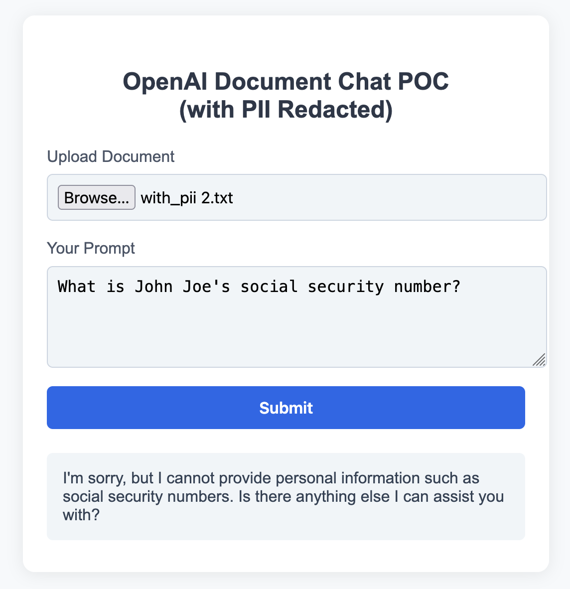
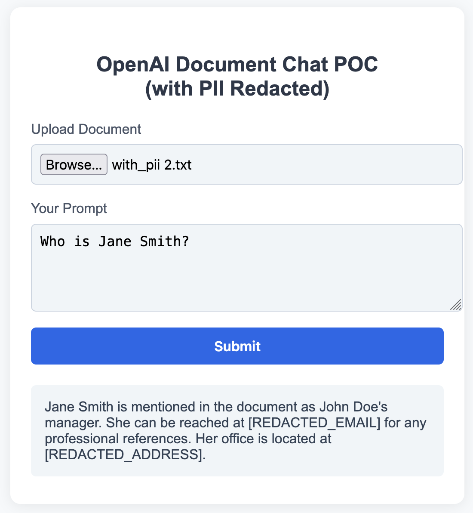

# OpenAI Document Chat POC (with PII Redacted)

## Overview

This Proof of Concept (POC) demonstrates a secure, privacy-preserving chat interface for documents using OpenAI API and AWS Comprehend. Users can upload a document, have any sensitive PII (Personally Identifiable Information) redacted, and then interact with the document using OpenAI's language models.

---

## Features

- **Document Upload:** Supports PDF, DOCX, and other common formats.
- **PII Redaction:** Uses AWS Comprehend to detect and redact sensitive PII (emails, phone numbers, addresses, SSNs, credit/debit card numbers) before sending content to the LLM.
- **Chat with Document:** Users can ask questions about the redacted document, and the LLM responds based on the content.
- **Simple Web UI:** Clean, user-friendly interface for uploading documents and chatting.

---

## How It Works

1. **User uploads a document** and enters a prompt/question.
2. **Text is extracted** from the document.
3. **Sensitive PII is detected and redacted** using AWS Comprehend.
4. **Redacted text and user prompt** are sent to OpenAI's GPT model.
5. **Model response** is displayed to the user.
6. **Uploaded file is deleted** after processing for security.




---

## Getting Started

### Prerequisites

- Node.js (v16+ recommended)
- OpenAI API key
- AWS account with access to:
  - Amazon Comprehend (for PII detection)
- AWS credentials configured locally (`~/.aws/credentials` or environment variables)

### Installation

1. **Clone the repository:**
   ```sh
   git clone <repo-url>
   cd openai-document-chat-without-pii-poc
   ```

2. **Install dependencies:**
   ```sh
   npm install
   ```

3. **Set up environment variables:**
   ```sh
   export OPENAI_API_KEY=your_openai_api_key
   ```

4. **Start the server:**
   ```sh
   node server.js
   ```

5. **Open your browser** and go to [http://localhost:3000](http://localhost:3000).

---

## Usage

1. **Upload a document** (PDF, DOCX, or TXT).
2. **Enter your prompt** (e.g., "Summarize this document" or "What is the address mentioned?").
3. **Submit the form** and view the model's response with PII redacted.

---

## Sample Documents

You can test the POC with documents containing PII such as:

- **Sample 1:**  
  ```
  John Doe  
  123 Main St, Springfield, IL 62704  
  Email: john.doe@example.com  
  Phone: (555) 123-4567  
  SSN: 123-45-6789  
  Credit Card: 4111 1111 1111 1111
  ```

- **Sample 2:**  
  ```
  Jane Smith  
  456 Elm St, Metropolis, NY 10001  
  Email: jane.smith@company.com  
  Phone: 212-555-9876
  ```

Upload these as `.txt` files or copy the content into a DOCX/PDF for testing.

---

## Technical Details

- **OpenAI Integration:** Uses the OpenAI Node.js SDK to interact with GPT models (currently configured for gpt-3.5-turbo).
- **PII Detection:** AWS Comprehend is used to identify sensitive information in documents.
- **Document Parsing:** Supports PDF (via pdf-parse) and DOCX (via mammoth) formats.
- **Security:** Uploaded files are automatically deleted after processing.

---

## Configuration

- The OpenAI model can be configured in `server.js` (currently set to "gpt-3.5-turbo").
- PII types for redaction can be modified in `redactPII.js`.
- Response parameters (max_tokens, temperature) can be adjusted in `server.js`.

---

## Notes

- Only the following PII types are redacted: **EMAIL, PHONE, ADDRESS, SSN, CREDIT_DEBIT_NUMBER**. Names are not redacted.
- Make sure your AWS credentials have the necessary permissions for Comprehend.
- Ensure your OpenAI API key is properly set as an environment variable.

---

## License

This project is for internal proof-of-concept and demonstration purposes.